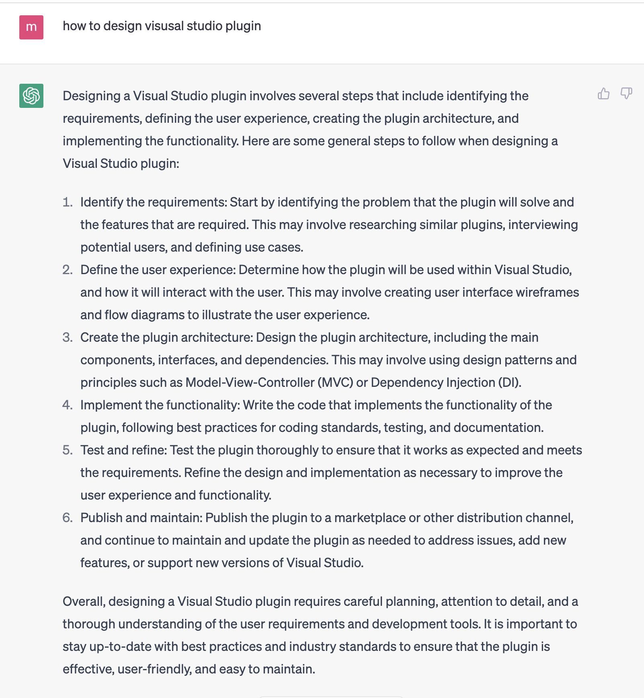
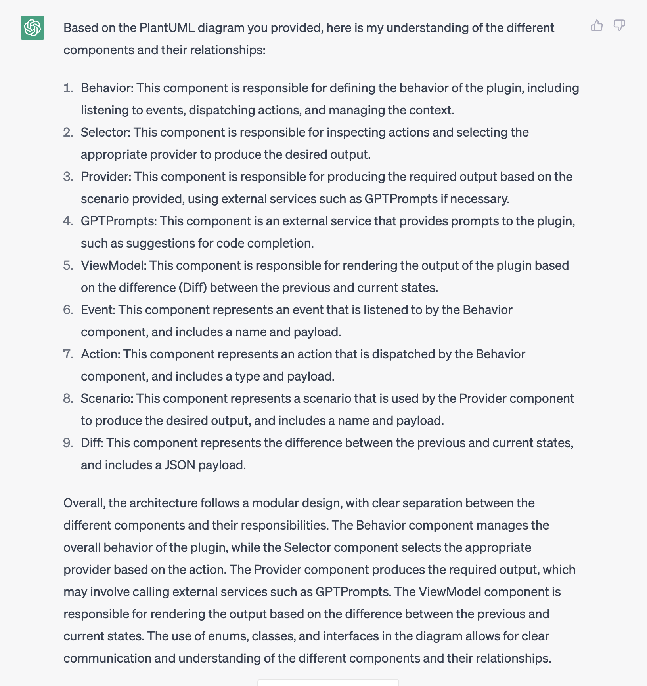
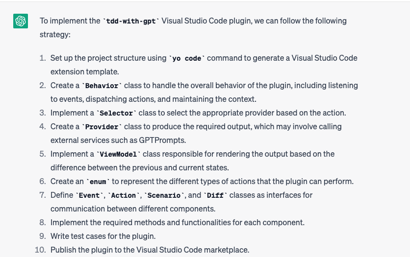
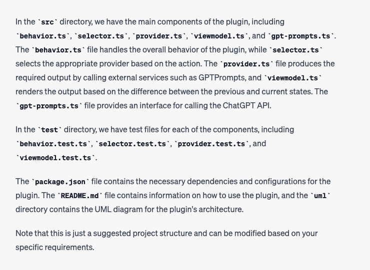

### design the architect

#### ask ideas to design architect



### confirm plugin architecture understanding

below plantuml is plugin architecture,  could you visualize your understanding to me

```uml
@startuml

!define INTRA_PROCESS_COLOR #438DD5

interface Behavior {
  +listenEvent(): Event
  +getContext(): Context
  +dispatchAction(): Action
}

interface Selector {
  +inspectAction(): Void
}

interface Provider {
  +produceDiff(scenario: Scenario): Diff
}

interface GPTPrompts {
  +callChatGPT(): JSON
}

interface ViewModel {
  +rendering(diff: Diff): void
}

Behavior -down-> Selector : dispatches
Selector -down-> Provider : calls (optional)
Provider -down-> GPTPrompts : calls
Selector -down-> ViewModel : invoke 

class Event << (E,INTRA_PROCESS_COLOR) >> {
  +name: String
  +payload: JSON
}
class Action << (E,INTRA_PROCESS_COLOR) >> {
  +type: ActionType
  +payload: JSON
}
class Scenario << (E,INTRA_PROCESS_COLOR) >> {
  +name: String
  +payload: JSON
}

class Diff << (E,INTRA_PROCESS_COLOR) >> {
  +json: JSON
}

enum ActionType {
  INTERACT,
  OPERATION,
  APPLY
}

Behavior -left-> Event : listens >>
Behavior -right-> Action : dispatches >>
Action -right-> Scenario : uses (OperationAction) >>
Provider -right-> Scenario : inputs >>
Provider -up-> Diff : outputs >>
ActionType <-up- Action : determines >>
@enduml
```

response from chatgpt



#### prepare input

i want develop a visusal studio code plugin called `tdd-with-gpt` by using `yo code` command

* input

1. requirements

```
In order to **developers**
They want to use TDD more efficiently to help improve the **efficiency** and **quality** of software development
This **tdd-with-gpt**
is a Visual Studio Code software development** plugin**
It leverages ChatGPT's ability to **automatically** generate, refactor, and verify production code based on test cases
Unlike today's manual implementations
Our product provides **efficient** functional implementation, **smooth** TDD development experience
```

3. plugin architecture

Overall, the architecture follows a modular design, with clear separation between the different components and their responsibilities. The Behavior component manages the overall behavior of the plugin, while the Selector component selects the appropriate provider based on the action. The Provider component produces the required output, which may involve calling external services such as GPTPrompts. The ViewModel component is responsible for rendering the output based on the difference between the previous and current states. The use of enums, classes, and interfaces in the diagram allows for clear communication and understanding of the different components and their relationships.

below is detail design

```
@startuml

!define INTRA_PROCESS_COLOR #438DD5

interface Behavior {
  +listenEvent(): Event
  +getContext(): Context
  +dispatchAction(): Action
}

interface Selector {
  +inspectAction(): Void
}

interface Provider {
  +produceDiff(scenario: Scenario): Diff
}

interface GPTPrompts {
  +callChatGPT(): JSON
}

interface ViewModel {
  +rendering(diff: Diff): void
}

Behavior -down-> Selector : dispatches
Selector -down-> Provider : calls (optional)
Provider -down-> GPTPrompts : calls
Selector -down-> ViewModel : invoke 

class Event << (E,INTRA_PROCESS_COLOR) >> {
  +name: String
  +payload: JSON
}
class Action << (E,INTRA_PROCESS_COLOR) >> {
  +type: ActionType
  +payload: JSON
}
class Scenario << (E,INTRA_PROCESS_COLOR) >> {
  +name: String
  +payload: JSON
}

class Diff << (E,INTRA_PROCESS_COLOR) >> {
  +json: JSON
}

enum ActionType {
  INTERACT,
  OPERATION,
  APPLY
}

Behavior -left-> Event : listens >>
Behavior -right-> Action : dispatches >>
Action -right-> Scenario : uses (OperationAction) >>
Provider -right-> Scenario : inputs >>
Provider -up-> Diff : outputs >>
ActionType <-up- Action : determines >>
@enduml
```

please design `implement strategy` for me and show me the project structure finally

* output





proceduer design

```
Create a Behavior class to handle the overall behavior of the plugin, including listening to events, dispatching actions, and maintaining the context.

Implement a Selector class to select the appropriate provider based on the action.

Create a Provider class to produce the required output, which may involve calling external services such as GPTPrompts.

Implement a ViewModel class responsible for rendering the output based on the difference between the previous and current states.

Create an enum to represent the different types of actions that the plugin can perform.

Define Event, Action, Scenario, and Diff classes as interfaces for communication between different components
```
