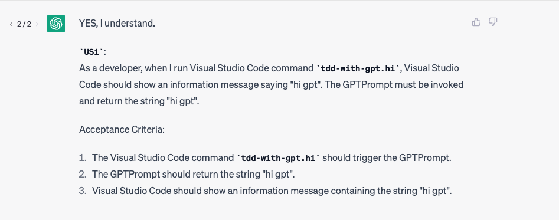
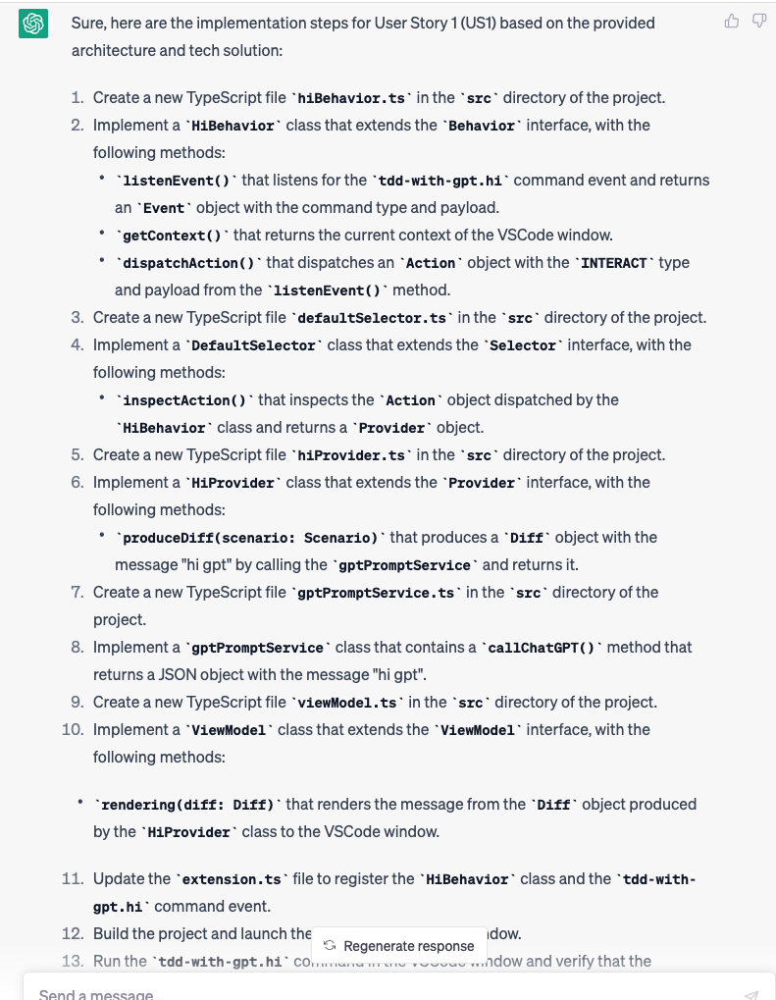

### add first user story

```
i got first user story `US1` for plugin `tdd-with-gpt`
description: 
as a developer,  when i run vscode.commands 'tdd-with-gpt.hi', vscode.window can show  information message "hi gpt"

tech solution
* commands 'tdd-with-gpt.hi' event will be catch by HiBehavior which inherit from Behavior
* HiBehavior will dispatch scenarios to DefaultSelector which inherit from seletor
* DefaultSelector will choose HiProvider to invoke
* HiProvider will call gptPromptService to get "hi gpt"

if you understand please say `YES` and show me what is `US1`

```



### get implement steps and test strategy for user story

```txt

please generate `implement steps` for `US1` according `implement strategy` and `tech solution`

```

implementation strategy



```
Create a new TypeScript file hiBehavior.ts in the src directory of the project.
Implement a HiBehavior class that extends the Behavior interface, with the following methods:
listenEvent() that listens for the tdd-with-gpt.hi command event and returns an Event object with the command type and payload.
getContext() that returns the current context of the VSCode window.
dispatchAction() that dispatches an Action object with the INTERACT type and payload from the listenEvent() method.
Create a new TypeScript file defaultSelector.ts in the src directory of the project.
Implement a DefaultSelector class that extends the Selector interface, with the following methods:
inspectAction() that inspects the Action object dispatched by the HiBehavior class and returns a Provider object.
Create a new TypeScript file hiProvider.ts in the src directory of the project.
Implement a HiProvider class that extends the Provider interface, with the following methods:
produceDiff(scenario: Scenario) that produces a Diff object with the message "hi gpt" by calling the gptPromptService and returns it.
Create a new TypeScript file gptPromptService.ts in the src directory of the project.
Implement a gptPromptService class that contains a callChatGPT() method that returns a JSON object with the message "hi gpt".
Create a new TypeScript file viewModel.ts in the src directory of the project.
Implement a ViewModel class that extends the ViewModel interface, with the following methods:
rendering(diff: Diff) that renders the message from the Diff object produced by the HiProvider class to the VSCode window.
Update the extension.ts file to register the HiBehavior class and the tdd-with-gpt.hi command event.
Build the project and launch the plugin in the VSCode window.
Run the tdd-with-gpt.hi command in the VSCode window and verify that the message "hi gpt" is displayed in the VSCode window.
Note: Don't forget to import the necessary dependencies and classes in each TypeScript file, such as the Behavior, Selector, Provider, ViewModel, Event, Action, Scenario, Diff, ActionType, and GPTPrompts from the architecture diagram.
```
