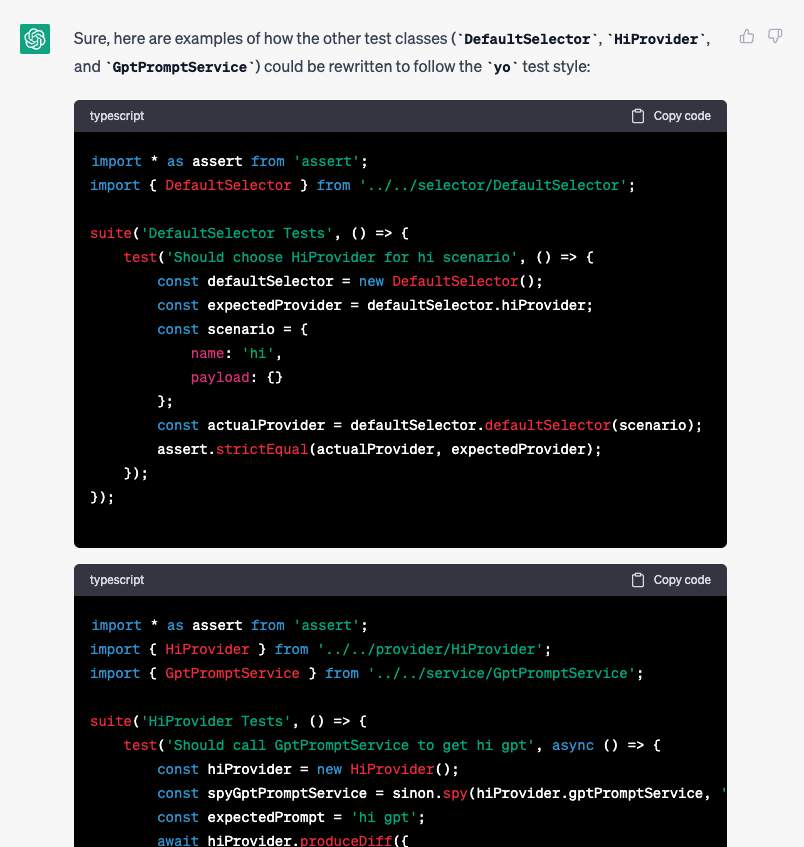

### 根据实现步骤生成测试用例描述和测试代码

* input

```
generate typescript unit tests for `HiBehavior `, `defaultSelector `, `HiProvider `,`gptPromptService ` following the yo test style
```

* output



详细见：test/suite/HIBehavior.test.js 等
