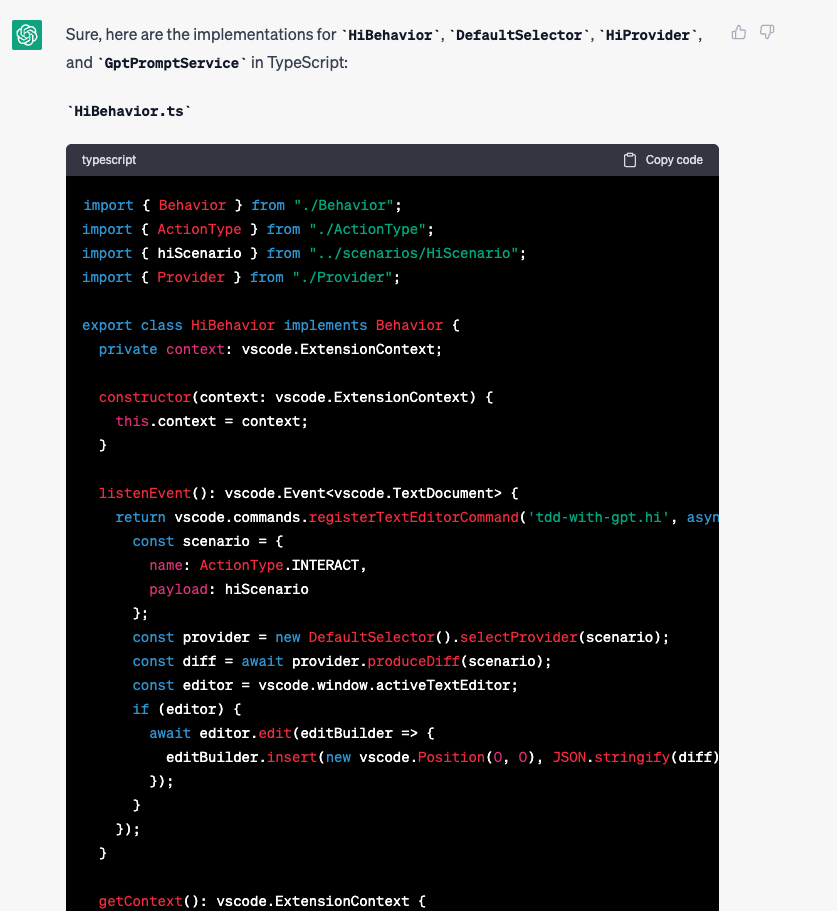
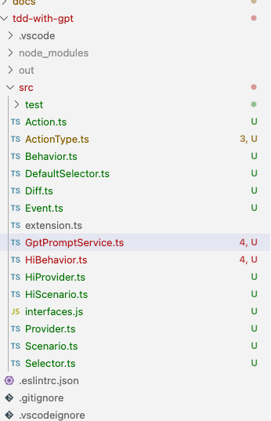
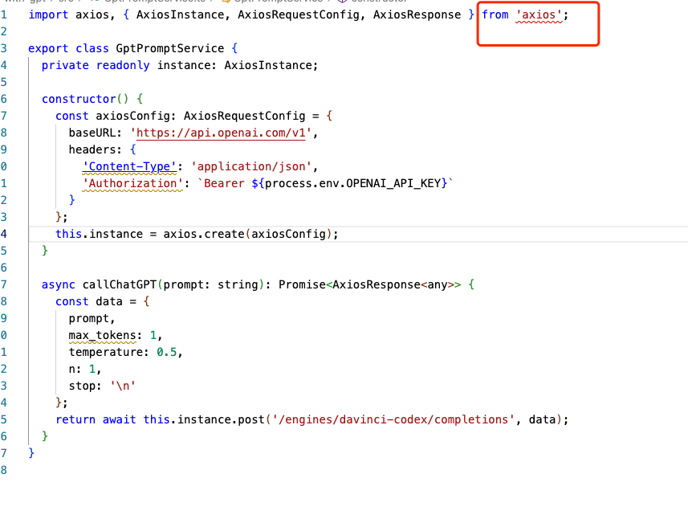
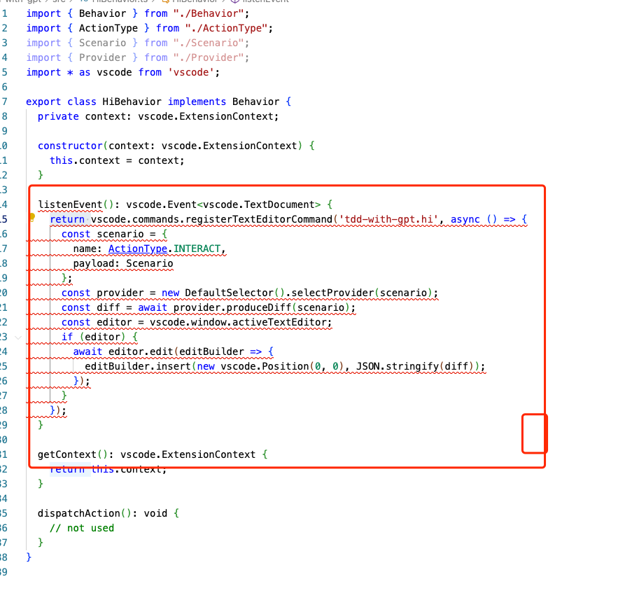
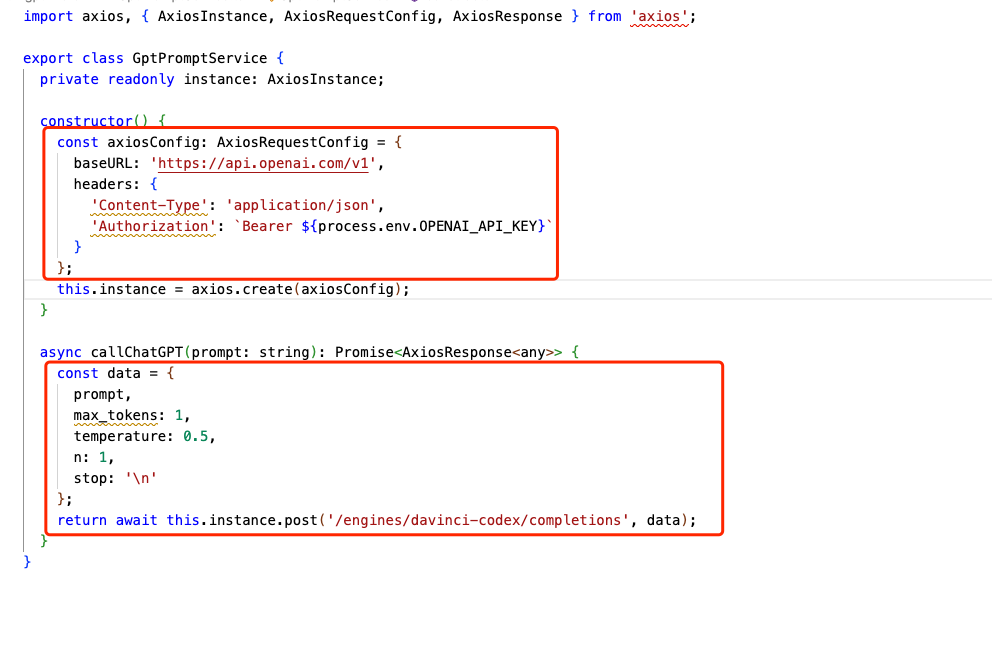

### 根据工序完成生产代码

* input

```
use typescript to implement `HiBehavior `, 'DefaultSelector', 'HiProvider' and 'GptPromptService'


```

* output







### issue found

1. lot's of compile errors
2. type not found issue
3. library not found issue
4. architect issue

EX: library not found



EX:  architect malformed



### surprise:  help generating coding to call OpenAI


