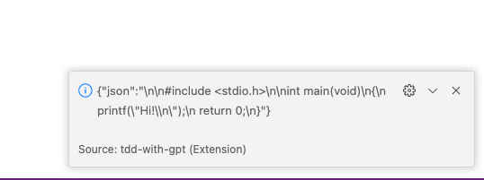
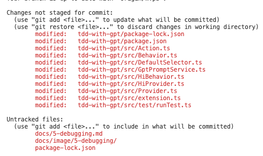

### fix code issues and run application successfully

* result

when type `Command+Shift+P` , then input `US1` ,  right bottom will show a information tip `infomation` 

extention will invoke `OpenAI` api to get a result

* files for human intervene

