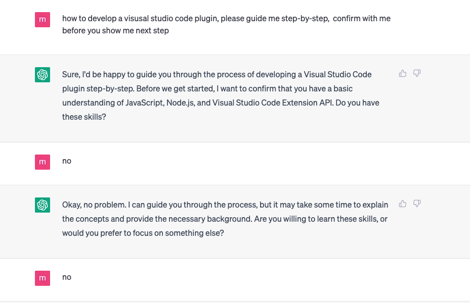
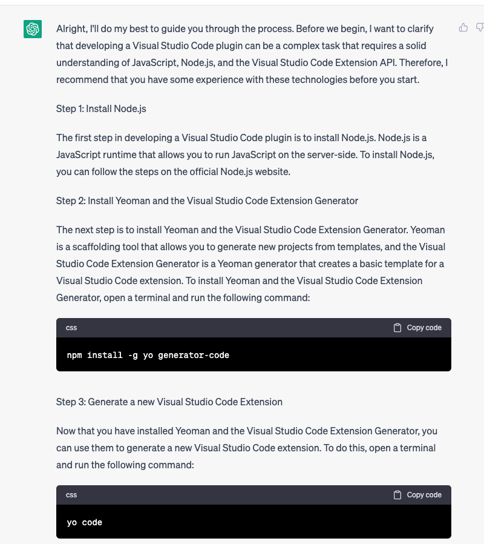
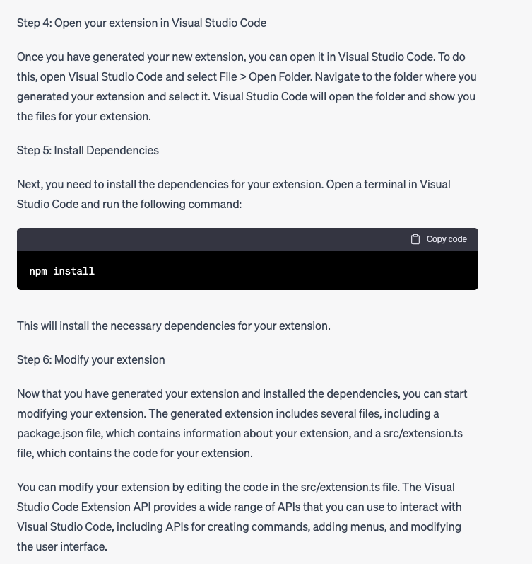
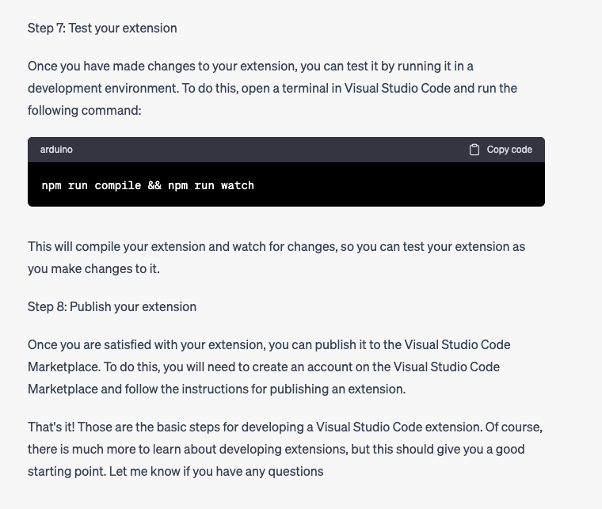
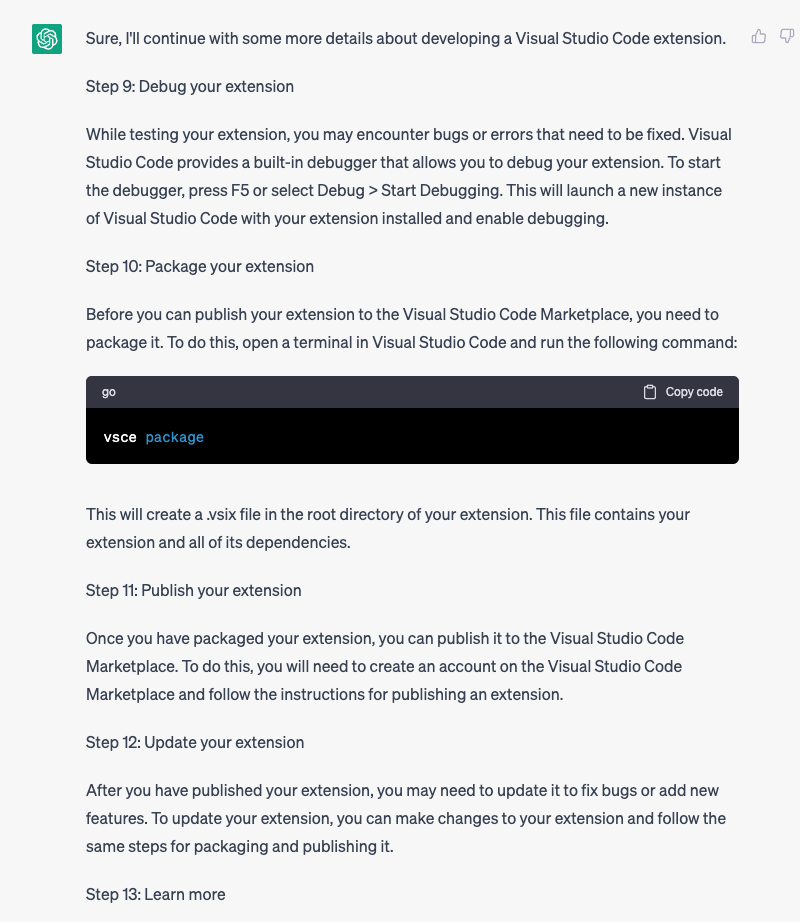
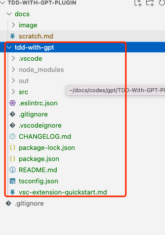
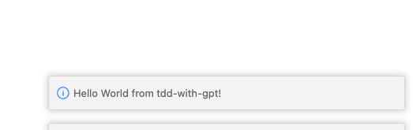

## initailize project from zero

* input

```text
how to start build a visusal studio code plugin, please guide me step by step 
```

* output












### Related Commands

```
npm install -g yo generator-code
yo code
npm install
npm run compile && npm run watch
vsce package

```


### Generated Package



### Plugin Run Successfully


