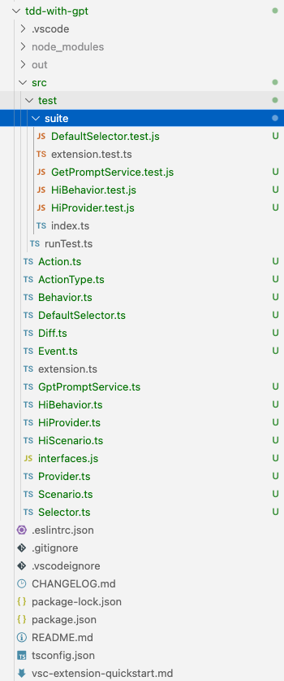

# target:   

pair with chatgpt to generate tdd-with-gpt plugin user story 1

## steps

1. initial whole project and scratch project . see .[docs/0-scratch.md](docs/0-scratch.md)
2. generate project architecture . see .[docs/1-arch.m](docs/1-arch.md)
3. generate implement strategy based on user story . see .[docs/2-us1.md](docs/2-us1.md)
4. generate tests . see .[docs/3-tests.md](docs/3-tests.md)
5. generate codes . see .[docs/4-coding.md](docs/4-coding.m)

## conclusion

* codes and tests been generated successfully,
* tests compile successfully with little human corrects (10%)
* codes compile successfully with little human corrects (20%)
* **application failed start **   *//Under expectation*
* **tests run failed** //Under expectation

## issues found

* context losting when chatgpt deal with multiple components, in story analysis step  .[docs/2-us1.md](docs/2-us1.md)
* chatgpt coding generate unstable in (.[docs/3-tests.md](docs/3-tests.md) and .[docs/4-coding.md](docs/4-coding.m))
* lot's of compile errors
* type not found issue
* library not found issue
* architect issue not meet requirements
